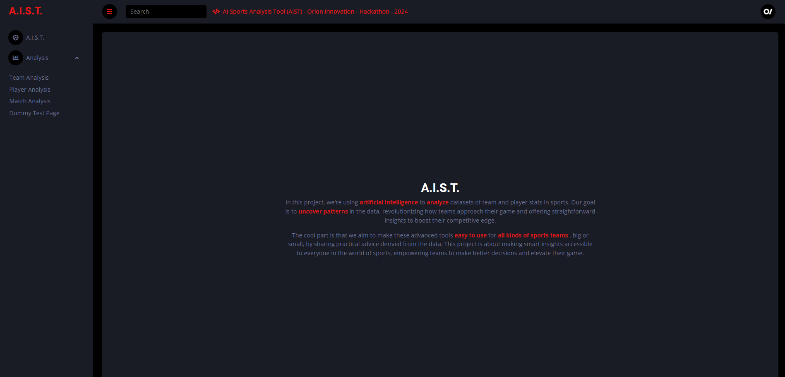
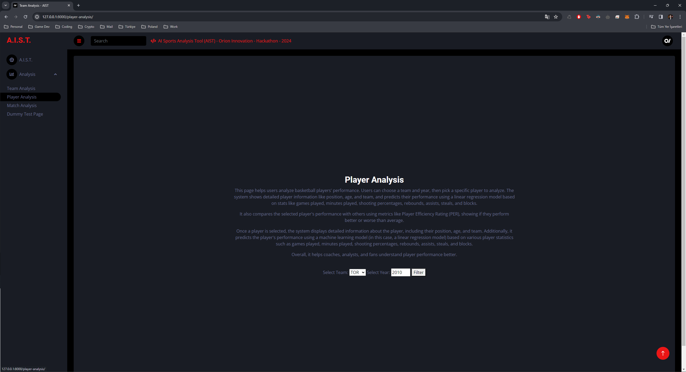
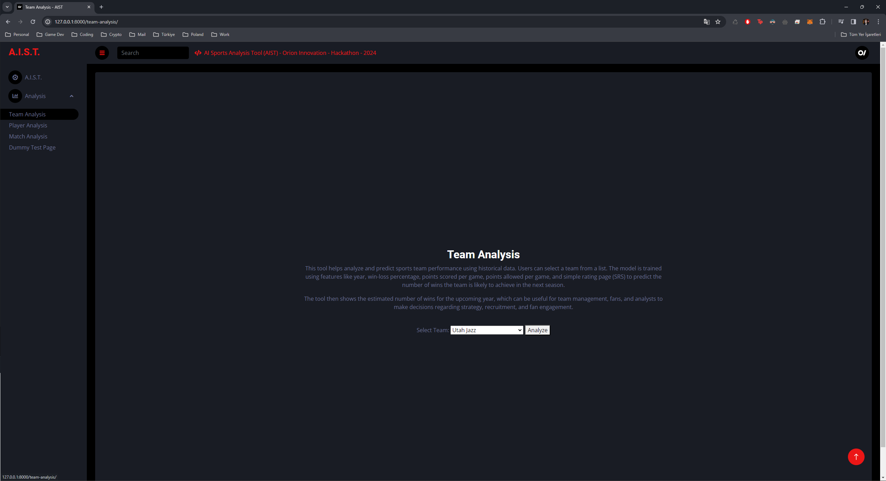
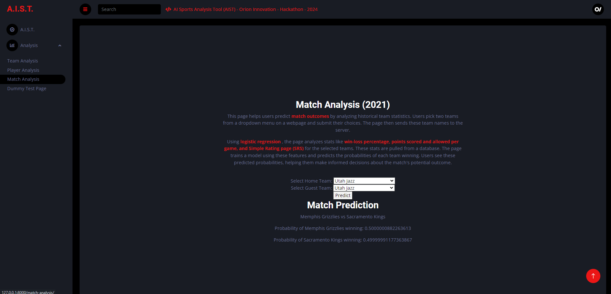

# Orion Innovation Hackathon - A.I.S.T
AI Sports Analysis Tool (AIST) - Orion Innovation - Hackathon - 2024
<br>
- Orion Innovation 
- (13 Feb 2024)


<p>
<br><b>About Project</b>
<br>In this project, we're using artificial intelligence to analyze datasets of team and player stats in sports. Our goal is to uncover patterns in the data, revolutionizing how teams approach their game and offering straightforward insights to boost their competitive edge.
<br>The cool part is that we aim to make these advanced tools easy to use for all kinds of sports teams, big or small, by sharing practical advice derived from the data. This project is about making smart insights accessible to everyone in the world of sports, empowering teams to make better decisions and elevate their game.
</p>

<br><b>How to Open This Project</b>
To open and run this project on your local machine, follow these steps:

## How to Open This Project

To open and run this project on your local machine, follow these steps:

1. **Clone the Repository:**
   Clone this repository to your local and locate under aist folder.
   ```bash
   cd aist
   ```

3. **Install Dependencies:**
   Navigate to the project directory and install the required dependencies. You can do this using pip, Python's package manager. Run:
   ```bash
   pip install -r requirements.txt
   ```
   This will install all the necessary Python packages specified in the `requirements.txt` file.

4. **Run the Development Server:**
   Start the Django development server by running:
   ```bash
   python manage.py runserver
   ```
   This will start the server locally, typically on `http://127.0.0.1:8000/`.

5. **Access the Application:**
   Once the server is running, open your web browser and navigate to `http://127.0.0.1:8000/` to access the application.


<br><b>Some Screenshots</b>

	
Screenshots           |  Screenshots 
:-------------------------:|:-------------------------:
  |  
  |  
