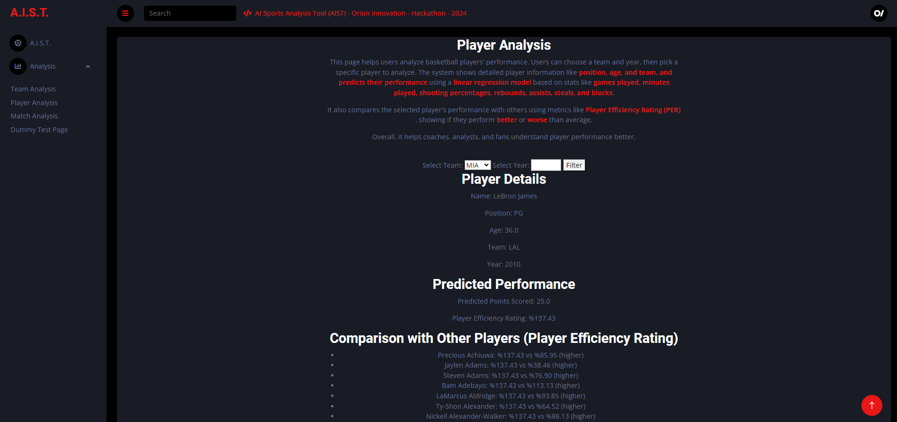
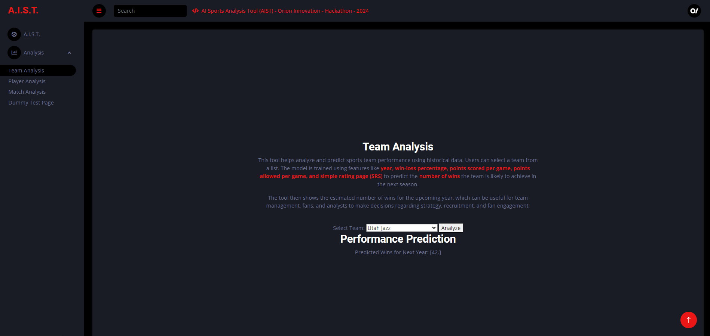

# Orion Innovation Hackathon - A.I.S.T
AI Sports Analysis Tool (AIST) - Orion Innovation - Hackathon - 2024
 
- Orion Innovation 
- (13 Feb 2024)

 <b>About Project</b>
 In this project, we're using artificial intelligence to analyze datasets of team and player stats in sports. Our goal is to uncover patterns in the data, revolutionizing how teams approach their game and offering straightforward insights to boost their competitive edge.
 The cool part is that we aim to make these advanced tools easy to use for all kinds of sports teams, big or small, by sharing practical advice derived from the data. This project is about making smart insights accessible to everyone in the world of sports, empowering teams to make better decisions and elevate their game.

 <b>Some Screenshots</b>

	
Screenshots           |  Screenshots 
:-------------------------:|:-------------------------:
  |  
  |  
